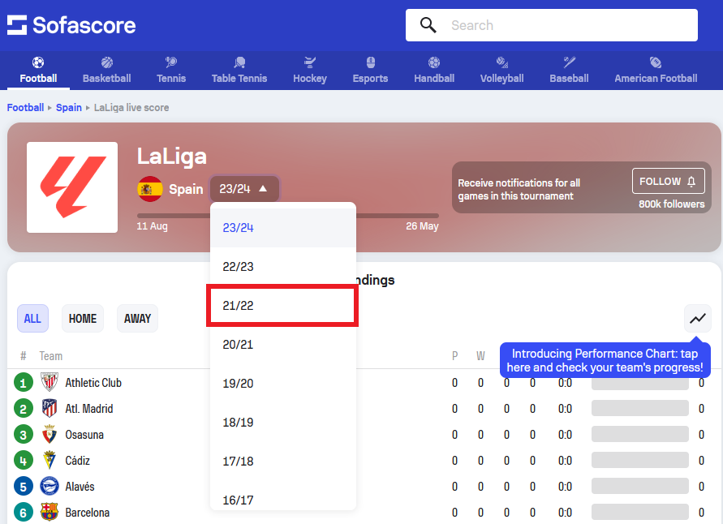
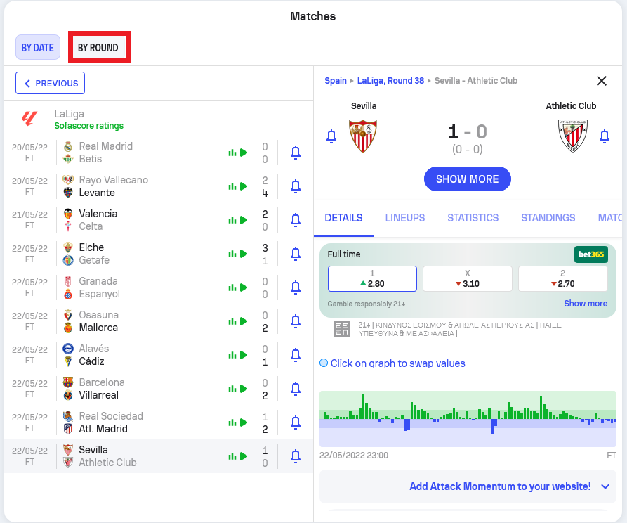
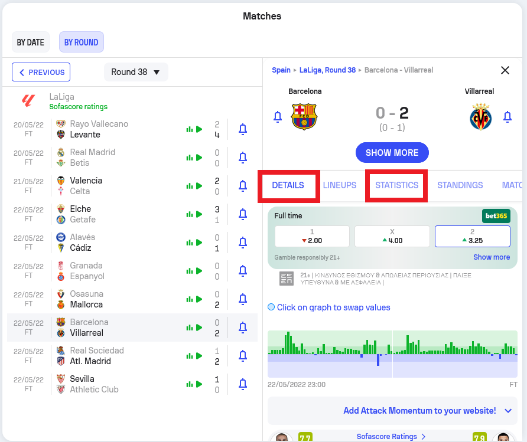

# sporty
A sports analytics project that aims to examine the intuition that the yellow cards of a football game are a factor possible to predict via features describing each team's certain statistics.
Indicatively, we used features shaped from the past three games of each team, such as fouls, yellow cards, ball possession etc. but also referee related features.

The case study of LaLiga Spain.  

## 📝 Workflow
- [Web Scraping](#web_scraping)
- [Data Preprocessing](#data_preprocessing)
- [Dimensionality Reduction](#dimensionality_reduction)
- [Predictive Modeling](#predictive_modeling)

## 🕸️ Web Scraping 

The data acquisition was conducted through applying web scraping techniques on the famous SofaScore website.  
By using the selenium webdriver we tried to mimic the consecutive clicks a human would follow in order to reach the desired data.

The 4 basic simple steps/clicks are illustrated below:
Not all essential clicks are listed.

**1. Click the button to choose the season of interest**
   
  
  
**2. Click the season of interest**  
  
  
  
**3. Click the sort by round button**  

  
  
**4. Click one after the other the tabs containing the information we thought to relevant**  

  

The  are stored separately (details | statistics) as csv files.  

## 🧹 Data Preprocessing 

Our project was split into two phases. During the first, we conducted several experiments solely based on the data under the details tab.
Later, during the second phase we also combined the available data of statistics tab.  

Our final dataset includes the following 21 features (numerical and binary variables).

The match-related features are:  
* Round of specific match
* Attendance of the match
* Difference in points between the two teams
* Yellow card category of the referee
* Red card category of the referee

The teams-related features are:  
* Mean value of yellow cards per team the last 3 games
* Mean value of tackles per team the last 3 games
* Mean value of ball possession (%) per team the last 3 games
* Mean value of lost possesions per team the last 3 games
* Mean value of interceptions per team the last 3 games
* Mean value of fouls commited per team the last 3 games
* Mean value of duels won per team the last 3 games
* Mean value of aerial duels won per team the last 3 games

Inside  data, you can also find the stadium name and the city that match occured.
That information is not used in our final dataset, but one could utilize it, perhaps to model weather conditions during the match. Such a feature is considered without a doubt
one that highly affects the yellow cards booked in a football game.

For training purposes we used the data of 4 seasons (18/19 - 21/22) and kept out as test set the season 22/23.  

Inside , you can also find some extra scraped seasons that were not used though, due to 
increased number of missing values. If you are interested to drop some of the variables that we used in our approach, we suggest to search for extra seasons that may contain useful information.

## ✂️ Dimensionality Reduction 

After ending up with numerous variables (we gathered anything that seemed relevant to the prediction task) we also checked the correlation between them.
Indeed for a significant number of them we observed high correlation.  

So we decided to also perform two of the most common dimentionality reduction methods.
Factor Analysis and Principal Components Analysis are quite similar, if you are not familiar with those techniques we suggest you to read this  that provides a side by side explanation.  

In general, our purpose is to decrease the number of variables before feeding the algorithms with data.

## 🎯 Predictive Modeling 

Our tests included the comparison between three of the most popular algorithms for tabular data.
We tested:  
* Random Forest
* Logistic Regression
* XGBoost

For the training process we used the  class along with a 5-fold cross-validation on a limited number and range of hyperparameters.

The highest score model was achieved by the following:  

* Factor Analysis (n_factors = 5)
* XGBoost (n_estimators=140, max_depth=2, learning_rate=0.05)

For the Factor Analysis we choose the number of factors based on the scree plot:  

  For

Results

